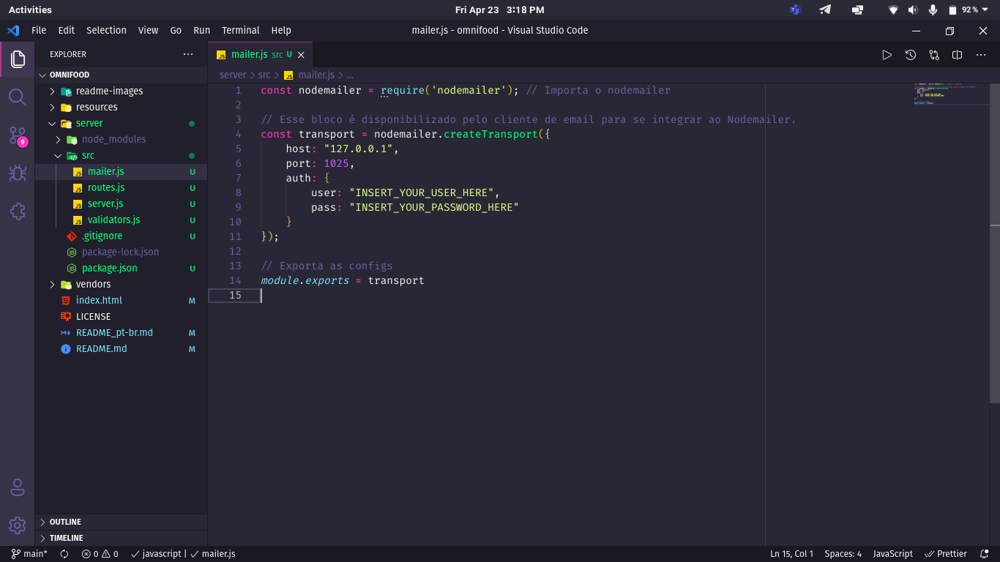
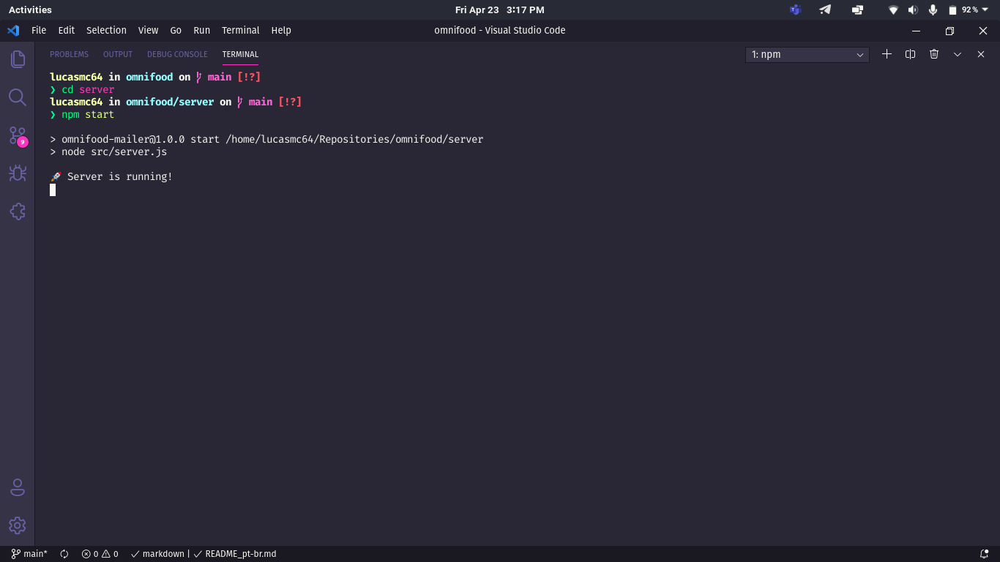

# :penguin: Omnifood

> :brazil: Caso prefira ler em outra língua, esse README foi escrito também em português. Clique [AQUI](/README_pt-br.md) para acessar.

## :dart: Goal

Omnifood came to bring quality flavor, but with a friendly price, for those who know how to appreciate the delicious art of cooking, taking health into account above all.

## :scroll: Some details

* Sending forms, unlike the original project, is done through Node.JS.
* The front end is made with HTML5, CSS3 and JavaScript.

## :thinking: How do I run the project on my machine?

The first step is to clone the project, either via terminal or GitHub Desktop, or even by downloading the compressed file (.zip). After that, go ahead.

### :hammer_and_wrench: Requirements

> If you just want to take a look at the interface, none of the requirements below are required, just open the *index.html* file in your preferred browser.
>
> However, if you want to test the form submission functionality, the tools below are required.

* [Node.JS](https://nodejs.org/).
* (Optional) [Yarn](https://yarnpkg.com/).
* [VSCode](https://code.visualstudio.com/) and the extension [Live Server](https://marketplace.visualstudio.com/items?itemName=ritwickdey.LiveServer).

### :mag: Installing dependencies

With Node.JS installed, access the *server* folder via terminal and run the `npm install` command. If you prefer to use Yarn, just run the command `yarn`.

### :goggles: Running the back-end

Before running the server, it is necessary to make a configuration. Open the *server/src/mailer.js* file and add your SMTP login credentials, also changing the * host * and * port * as provided by your preferred service.

> For my tests I used the program [NodemailerApp](https://snapcraft.io/nodemailerapp).

Access the *server* directory via terminal and run `npm start` (or` yarn start`) and a message similar to the following will appear for you:

Note: If this was not the result, check that the requirements and previous steps have been met.

### :sparkles: Running the front-end

Open the project folder in VSCode and, by right-clicking on the *index.html* file, choose *Open with Live Server*. A server will be started by the extension and it will open the website in your default browser.

> Don't forget to leave the back-end running in parallel!

## :tada: If everything went well...

Now you are running the project beautifully!
