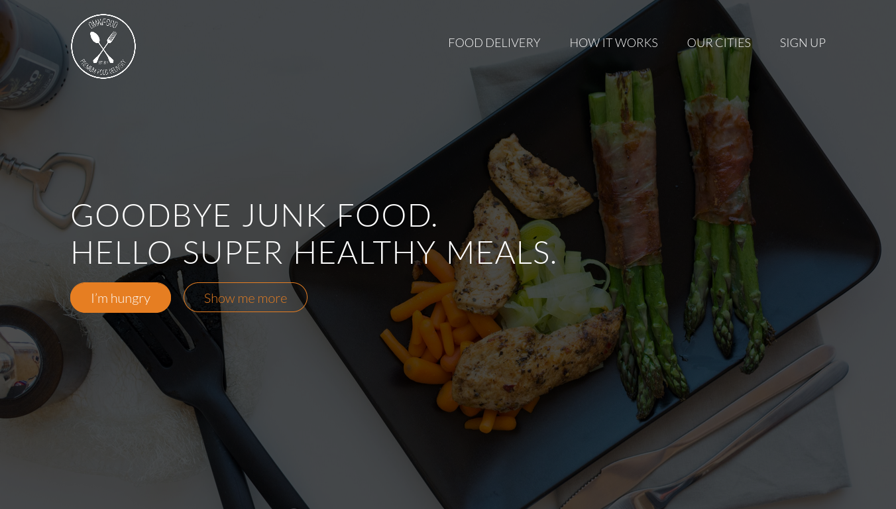
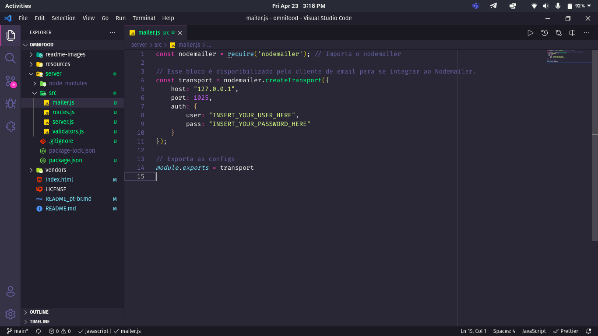
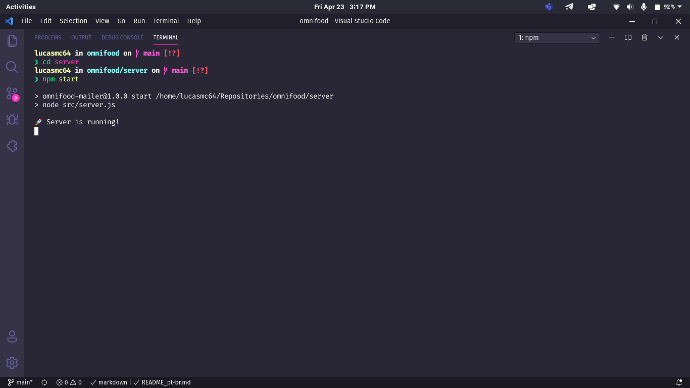

# :penguin: Omnifood

> :us: If you prefer to read in another language, this README was also written in english. Click [HERE](/README.md) to access.

## :dart: Objetivo

Omnifood veio para trazer sabor com qualidade, mas com um precinho camarada, para aqueles que sabem apreciar a deliciosa arte da culinária, levando em conta a saúde acima de tudo.

## :scroll: Alguns detalhes

* O envio de formulários, ao contrário do projeto original, é feito através do Node.JS.
* O front end é feito com HTML5, CSS3 e JavaScript.

## :thinking: Como rodar o projeto em minha máquina?

O primeiro passo é clonar o projeto, seja via terminal ou GitHub Desktop, ou mesmo baixando o arquivo compactado (.zip). Após isso, siga  adiante.

### :hammer_and_wrench: Requisitos

> Caso você queira apenas dar uma olhada na interface, não é necessário nenhum dos requisitos abaixo, apenas abra o arquivo *index.html* no navegador de sua preferência.
>
> Porém, caso queira testar a funcionalidade de envio de formulário, as ferramentas abaixo são necessárias.

* [Node.JS](https://nodejs.org/).
* (Opcional) [Yarn](https://yarnpkg.com/).
* [VSCode](https://code.visualstudio.com/) e a extensão [Live Server](https://marketplace.visualstudio.com/items?itemName=ritwickdey.LiveServer).

### :mag: Instalando dependências

Com o Node.JS instalado, acesse a pasta *server* via terminal e rode o comando `npm install`. Caso você prefira usar o Yarn, basta rodar o comando `yarn`.

### :goggles: Rodando o back-end

Antes de executar o servidor é necessário fazer uma configuração. Abra o arquivo *server/src/mailer.js* e adicione suas credenciais SMTP de login, trocando também o *host* e a *port* conforme fornecido pelo seu serviço de preferência.

> Para meus testes usei o programa [NodemailerApp](https://snapcraft.io/nodemailerapp).

Acesse o diretório *server* via terminal e execute `npm start` (ou `yarn start`) e uma mensagem parecida com a seguinte aparecerá para você:

Obs.: Caso não tenha sido esse o resultado, verifique que os requisitos e os passos anteriores tenham sido cumpridos.

### :sparkles: Rodando o front-end

Abra a pasta do projeto no VSCode e, clicando com o botão direito sobre o arquivo *index.html*, escolha *Open with Live Server*. Um servidor será iniciado pela extensão e ela abrirá o site no seu navegador padrão.

> Não se esqueça de deixar o back-end rodando em paralelo!

## :tada: Se tudo deu certo...

Agora você está o projeto rodando lindamente!
